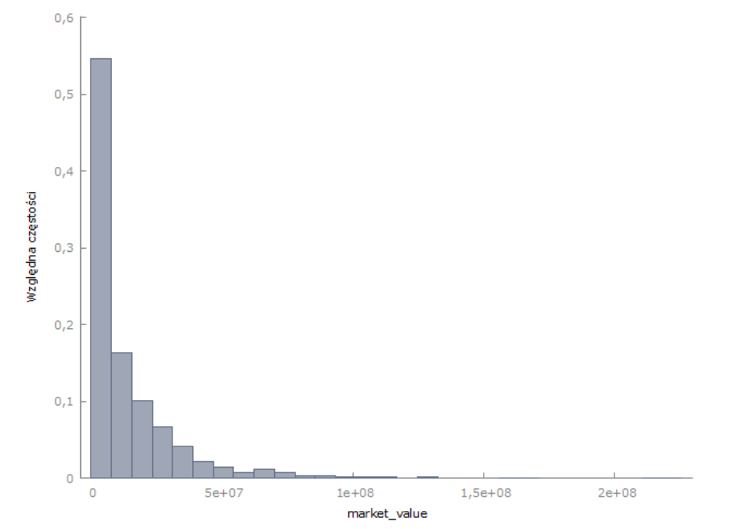
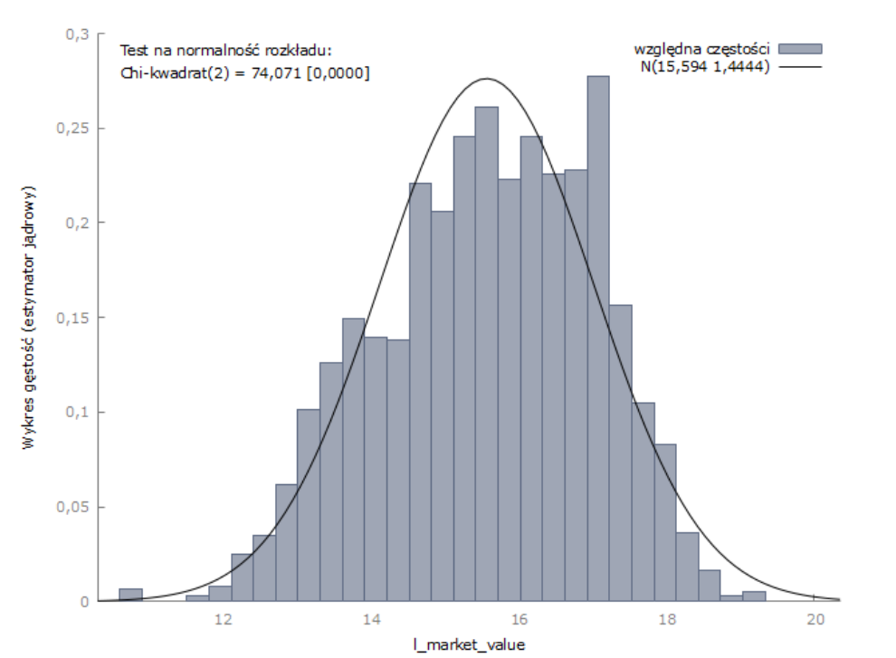
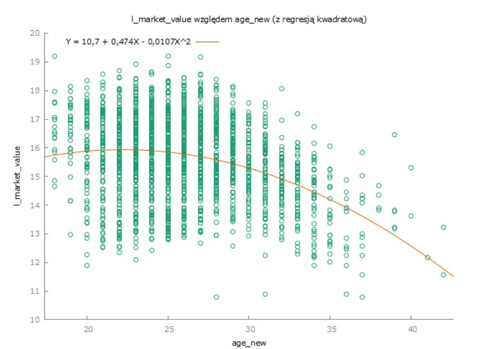
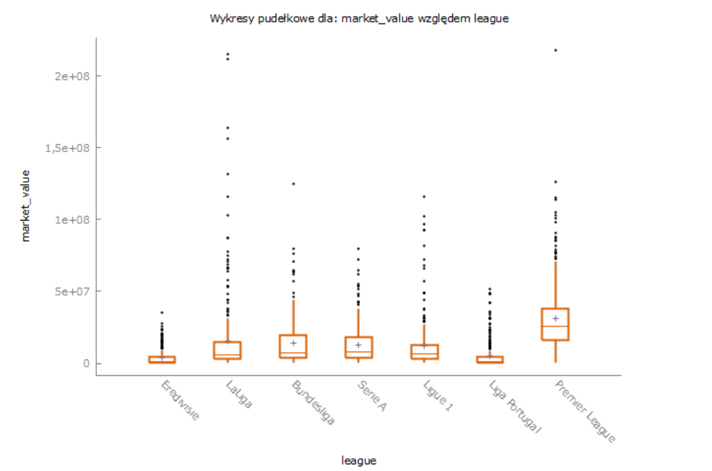

# Determinants of Football Player Market Value in Europe's Top Leagues

Econometric analysis of what drives the market valuation of professional footballers across the seven strongest European leagues.

Bachelor's thesis, University of Gdańsk, Faculty of Management, Informatics and Econometrics (Data Science specialization), 2026.
Supervisor: dr Marta Chylińska.

---

## Key findings

- **Log-linear OLS model** on **2,006 outfield players** from **7 European leagues** (2025/26 season), **R² = 0.71**, HC1 robust standard errors.
- **A single composite match rating outperforms a full set of traditional statistics.** A model using only the rating (R² = 0.714) fits better than one built on goals, assists, shots, tackles and interceptions combined (R² = 0.697), while estimating half as many parameters.
- **League prestige is a major independent determinant.** Holding player quality constant, Eredivisie players are valued roughly 90% below Premier League players.
- **Elite club membership carries a ~155% valuation premium**, independent of individual performance.
- **Residual analysis reveals a systematic "shop window effect":** young attackers at Portuguese and Dutch selling clubs are consistently valued far above what current-season performance justifies, because the market prices in an expected transfer to a wealthier league.

---

## Research question

Which player and environment characteristics shape a footballer's market value, and how strongly?

Three hypotheses were tested:

| # | Hypothesis | Result |
|---|---|---|
| H1 | Age affects market value non-linearly | Confirmed |
| H2 | League prestige and elite club membership raise valuations independently of performance | Confirmed |
| H3 | A composite match rating is a sufficient proxy for player quality | Confirmed |

---

## Theoretical framework

The model follows the **hedonic pricing** approach (Rosen, 1974), treating a player as a bundle of characteristics whose market price is the sum of their implicit values, grounded in **human capital theory** (Becker, 1964). Prior work informing the specification: Dobson & Gerrard (1999), Frick (2007), Franck & Nüesch (2012), Herm et al. (2014), Müller et al. (2017).

---

## Data

**Sources:** two publicly available Kaggle datasets, with underlying data from SofaScore (market values, match ratings) and FBref (detailed performance statistics). Cross-sectional snapshot from late April / early May 2026, covering most of the 2025/26 season.

**Leagues:** Premier League, La Liga, Bundesliga, Serie A, Ligue 1, Eredivisie, Liga Portugal.

**Sample construction:**

- Players with fewer than **600 league minutes** were excluded, removing fringe squad members whose ratings are unreliable and whose valuations reflect speculation rather than current performance.
- **Goalkeepers excluded.** Their valuation logic differs structurally from outfield players.
- **Positions reclassified.** The SofaScore label differs from FBref's classification for 168 players. The largest group (93) are wide attackers labelled as midfielders; reclassifying them prevents the forward premium from being biased downward. The remaining corrections run in other directions.
- Age was missing for Eredivisie and Liga Portugal in the FBref-based dataset and was backfilled separately so the variable covered the full sample.

**Final analytical sample: N = 2,006.**

### Descriptive statistics

| Variable | Mean | Median | Std. dev. | Min | Max |
|---|---|---|---|---|---|
| Market value (€m) | 14.04 | 6.40 | 20.11 | 0.05 | 218.00 |
| Match rating | 6.81 | 6.79 | 0.22 | 6.04 | 8.00 |
| Minutes played | 1,566 | 1,528 | 604 | 600 | 2,970 |
| Age (years) | 26.13 | 26.00 | 4.10 | 18 | 42 |

The mean market value is more than twice the median, confirming strong right skew and motivating the log transformation.





---

## Model specification

```
ln(market_value) = β₀
                 + β₁…β₆ · league dummies      (base: Premier League)
                 + β₇ · top_club
                 + β₈ · rating
                 + β₉ · ln(minutes_played)
                 + β₁₀ · age + β₁₁ · age²
                 + β₁₂ · midfielder + β₁₃ · forward   (base: defender)
                 + ε
```

**Transformation choices:**

- **Log of market value.** Corrects strong right skew and turns coefficients into percentage effects, which matches how the transfer market actually behaves.
- **Log of minutes played.** Captures diminishing marginal returns. The gap between 600 and 1,200 minutes (bench player vs. rotation player) matters far more than the gap between 2,400 and 3,000 (both are starters).
- **Age and age squared.** Models the career-cycle parabola.
- **Match rating** instead of raw counting stats. The rating is position-adjusted, so defenders are not penalised for low offensive output.

---

## Results

| Variable | Coefficient | Robust SE (HC1) | t |
|---|---|---|---|
| const | −0.7638 | 0.9119 | −0.84 |
| Eredivisie | −2.2985*** | 0.0672 | −34.20 |
| La Liga | −0.9951*** | 0.0481 | −20.69 |
| Bundesliga | −0.8988*** | 0.0461 | −19.51 |
| Serie A | −0.8658*** | 0.0467 | −18.53 |
| Ligue 1 | −1.0563*** | 0.0540 | −19.58 |
| Liga Portugal | −2.1598*** | 0.0745 | −28.98 |
| top_club | 0.9354*** | 0.0392 | 23.89 |
| rating | 1.9658*** | 0.0915 | 21.49 |
| ln(minutes) | 0.4048*** | 0.0490 | 8.27 |
| age | 0.1919*** | 0.0538 | 3.57 |
| age² | −0.0059*** | 0.0010 | −5.99 |
| midfielder | 0.0329 | 0.0404 | 0.82 |
| forward | 0.3512*** | 0.0461 | 7.62 |

`*** p < 0.01`. Base categories: Premier League, defender.
**R² = 0.7145 · Adjusted R² = 0.7127 · SER = 0.7743**

### Interpretation

**Match rating** is the strongest predictor. A realistic move of +0.1 rating points corresponds to roughly a **+21.7% increase in market value**. Interpreting a full one-point increase (≈ +614%) is not meaningful, since the rating's standard deviation is only 0.22.

**Minutes played:** a 1% increase in minutes corresponds to a **0.40% increase in value.** Regular playing time signals both fitness and the coach's trust.

**Age:** the fitted parabola peaks at ≈16.3 years, below the sample minimum of 18. Within the observed range (18–42), value therefore declines monotonically with age, and the decline accelerates: around the sample mean of 26, each additional year costs roughly **−10.9%** of market value, holding everything else constant. The positive linear term is an artifact of fitting a parabola to data containing exceptionally highly valued teenagers (e.g. Yamal, Cubarsí), not evidence of rising value among adults.



**League:** every league carries a significant discount relative to the Premier League. This gap is financial rather than sporting. Premier League clubs' broadcast revenue (≈€3.9bn in 2023/24) was more than double La Liga's (€1.8bn), and English money is spread far more evenly across clubs, which is why the gap shows up in medians and not just at the top.



**Position:** forwards command a **~42% premium** over defenders; the midfielder–defender difference is not statistically significant.

---

## Diagnostics

| Test | Statistic | p-value | Decision (α = 0.05) |
|---|---|---|---|
| White (heteroskedasticity) | TR² = 297.10, χ²(16) | 0.0000 | Reject H₀ |
| Doornik-Hansen (normality of residuals) | χ²(2) = 67.41 | 0.0000 | Reject H₀ |
| RESET (functional form) | F(2, 1990) = 23.47 | 8.4e−11 | Reject H₀ |
| VIF | - | - | No problematic collinearity beyond the expected age / age² correlation |

**How these were handled:**

- **Heteroskedasticity** is expected in cross-sectional valuation data, since dispersion is naturally wider among expensive players. All reported inference uses **HC1 robust standard errors**, which keeps inference valid without changing the estimator.
- **Non-normal residuals** are near-inevitable at N = 2,006; the residual distribution is visually close to normal with no heavy tails, and the CLT guarantees asymptotic normality of the OLS estimator regardless.
- **RESET rejection** signals that a linear-in-parameters form cannot fully capture the transfer market. Rather than hiding this, I estimated a **reference model** using only individual performance statistics, which *passes* both White (p = 0.092) and RESET (p = 0.059), but its R² collapses to **0.171**. The diagnostic failures in the main model are therefore the price of including the variables that actually explain valuation (league, club status, playing time, age), not a specification error.

---

## Residual analysis: who the market misprices

Residuals were examined to identify players whose valuations deviate systematically from the model.

**Most overvalued relative to the model.** The pattern is consistent: young attackers and attacking midfielders at Liga Portugal and Eredivisie clubs.

| Player | League | Pos | Age | Actual (€m) | Model (€m) | Residual |
|---|---|---|---|---|---|---|
| Geovany Quenda | Liga Portugal | M | 19 | 49.0 | 2.7 | +2.89 |
| Rodrigo Mora | Liga Portugal | M | 18 | 42.0 | 2.9 | +2.69 |
| Givairo Read | Eredivisie | D | 19 | 24.0 | 1.8 | +2.59 |
| Samu Aghehowa | Liga Portugal | F | 22 | 52.0 | 4.3 | +2.48 |

This is the **shop window effect**. Clubs like Benfica, Porto and Sporting operate as intermediaries in the European talent trade: they acquire young players, showcase them domestically and in European competition, then resell at a large margin. The market values these players not on current output but on an anticipated move to a wealthier league, information that a model built on current-season characteristics cannot capture.

**Most undervalued relative to the model** were predominantly defenders in Ligue 1 and Serie A with strong ratings and regular minutes, suggesting the composite rating overstates the value of defensive players at weaker clubs.

The largest residuals are interpretable and systematic rather than random.

---

## Limitations

- **Missing variables:** remaining contract length, injury history and social-media following were unavailable in the source data. All three are plausibly important, and their absence likely explains part of the RESET rejection.
- **Cross-sectional design.** No ability to track valuation changes over time.
- **The age vertex is not directly interpretable**, being distorted by exceptionally valued teenagers in the sample.
- **The dependent variable is a market value estimate, not a realised transfer fee.** SofaScore valuations combine algorithmic estimates with community input; Herm et al. (2014) show such estimates predict actual fees well, but they are an approximation.
- **`top_nation` was dropped.** A dummy for players from traditional footballing powers proved statistically insignificant, plausibly because a sample restricted to Europe's top 7 leagues is already heavily selected on quality, leaving too little variation to detect an effect.

---

## Possible extensions

- Add contract and marketing variables to capture what currently drives the largest residuals.
- Use more flexible functional forms or tree-based methods to handle non-linearity.
- Extend to a panel design to track valuation trajectories over time.
- Replicate the model in Python (pandas / statsmodels), planned.

---

## Repository contents

```
├── README.md
├── gretl/                 # Gretl command script
├── figures/               # distribution plots, age curve, league boxplots
└── thesis/                # full thesis (PL)
```

---

## Reproducing the analysis

1. Download both source datasets from the links below.
2. Merge on player name. Keep players with at least 600 league minutes and exclude goalkeepers.
3. Reassign positions from the full FBref positional string, applying priority
   FW > MF > DF: any forward code -> forward, midfielder code with no forward
   component -> midfielder, otherwise defender.
4. Install [Gretl](http://gretl.sourceforge.net/) (free, open source) and run `gretl/player_valuation_model.inp`.

---

## Data sources and licensing

- Yorgun, K., *European Top Leagues Player Stats 25-26*, [Kaggle](https://www.kaggle.com/datasets/kaanyorgun/european-top-leagues-player-stats-25-26)
- Sidorowicz, H., *Football Players Stats (2025–2026)*, [Kaggle](https://www.kaggle.com/datasets/hubertsidorowicz/football-players-stats-2025-2026)

**Data availability.** The processed dataset is not redistributed in this repository. Market values and match ratings originate from SofaScore, whose terms restrict redistribution, and the source dataset author explicitly disclaims ownership of that data. Both source datasets are linked above and the preprocessing steps are documented above, so the analytical sample can be reconstructed.

---

## Author

Maciej Sochacki
sochackim41@gmail.com
